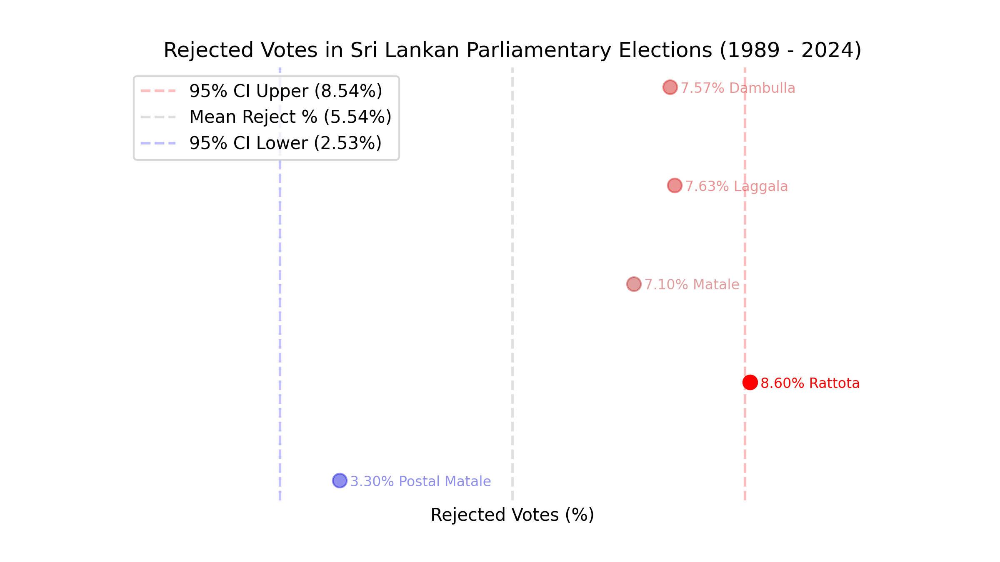
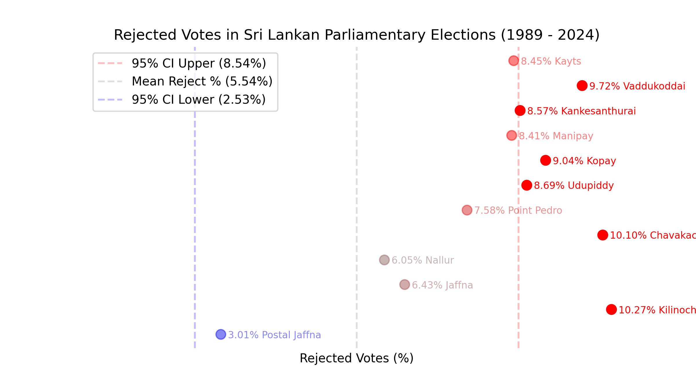
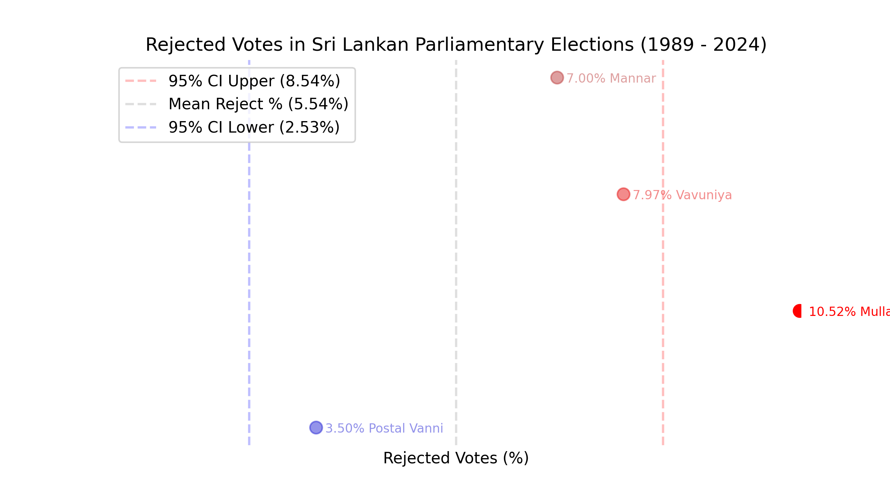
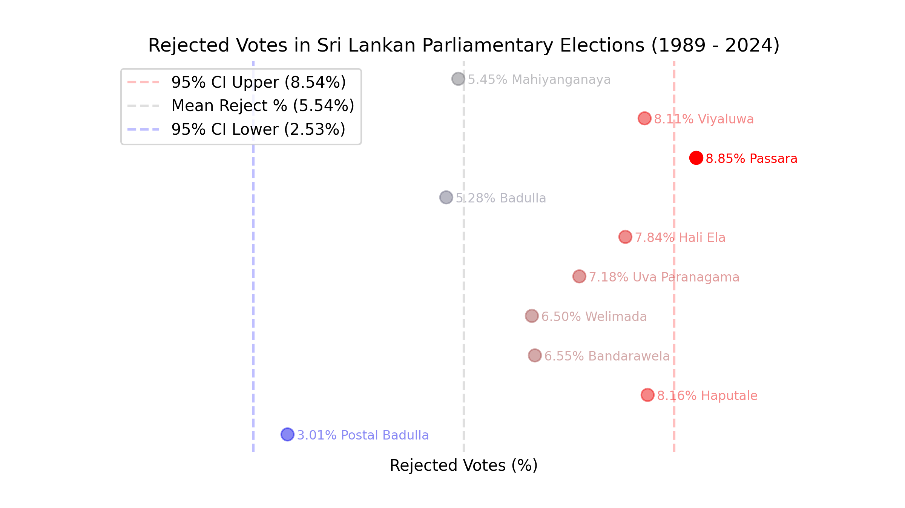

# Rejected Votes in Sri Lankan Parliamentary Elections

In this analysis, we explore three questions:

- **Were rejected votes significantly higher or lower** in some election years?
- In particular electoral districts?
- In particular polling divisions/postal vote results?

We exclude results from 2000 because the Election Commission's [official results](https://elections.gov.lk/web/wp-content/uploads/election-results/parliamentary-elections/general-election-2000.pdf) do not contain rejected votes at a polling division level.

## Q1. Were % rejected votes significantly higher or lower in some election years?

Before we answer this question, let's clarify what *significantly higher* and *significantly lower* means.

If the percentage of rejected votes followed the *same pattern* in every election, then any differences we observe would simply be due to random chance. We can estimate what's "normal" by calculating the average (mean) percentage of rejected votes across all elections. If we assume this follows a normal distribution, we can calculate confidence intervals (CIs) that tell us the expected range of values at a certain confidence level (say 95%).

Now, if the percentage of rejected votes for any election year falls outside these confidence intervals, we can conclude that this election's rejection rate was significantly higher or lower than normal.

When we plot the data for election years, we get the following:

The mean rejection rate across all elections is 5.54%, and the 95% confidence interval ranges from 4.11% to 6.97%.

No election's rejection rate falls outside this range, though 2010 (6.91%) comes close.

Therefore, we can conclude that there is no significant evidence that rejected votes were notably higher or lower in any particular election year.

## Q2. Were rejected votes significantly higher in particular electoral districts?

When we apply the same analysis to electoral districts, we get the following plot.

The mean rejection rate across all elections remains unchanged at 5.54%, but the 95% confidence interval is larger, from 3.27% to 7.80%, since we have a different number of samples.

Nuwara Eliya (8.57%), Jaffna (8.39%) and Vanni (7.98%) have % rejected votes above the upper limit of the confidence interval. No electoral district is below the lower limit.

And so, we can conclude that there is evidence (95% condifience), that  Nuwara Eliya , Jaffna  and Vanni have % rejected cotes significantly higher than the limit.

## Q3. Were rejected votes significantly higher in particular polling divisions or postal vote results?

For polling divisions/postal votes, we get this plot. 

As before, the mean rejection rate across all elections remains unchanged at 5.54%, but the 95% confidence interval is even larger, from 2.53% to 8.54%.

Postal Votes for Batticaloa (1.69%), Kegalle (2.48%), and Ratnapura (2.36%) is below the lower limit of the confidence interval. Several results in the Kandy, Matale, Nuwara-Eliya, Jaffna, Vanni, and Badulla electoral districts are above the upper limit of the confidence interval.

Let's visualize these districts in further detail.

### Kandy 

- Teldeniya (8.82%)

### Matale 

- Rattota (8.60%)

### Nuwara-Eliya

- Nuwara Eliya Maskeliya (8.64%)
- Hanguranketha (9.07%)
- Walapane (9.48%)

### Jaffna 

- Vaddukoddai (9.72%)
- Kankesanthurai (8.57%)
- Kopay (9.04%)
- Udupiddy (8.69%)
- Chavakachcheri (10.10%)
- Kilinochchi (10.27%)

### Vanni 

- Mullaitivu (10.52%)

### Badulla 

- Passara (8.85%)

# Appendix: Code & Data used in this Analysis

- [https://github.com/nuuuwan/elections_lk](https://github.com/nuuuwan/elections_lk/blob/main/example_analysis/rejected_votes/README.md)
